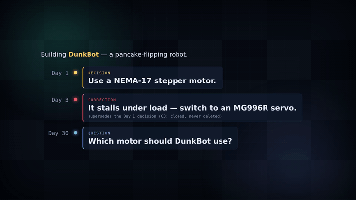

# MultiService IA

> **Les LLM oublient. Votre mémoire ne devrait pas.**
>
> *Un substrat de mémoire souverain pour LLM — une force, pas une dépendance.*

*([English version](README.md))*

<p align="center">
  
</p>

**Même question. Même historique. Deux réponses différentes.**  
La différence ? L'une sait qu'une décision a été corrigée.

Sans mémoire, l'agent re-recommande un moteur **abandonné**. Avec MultiService IA, il voit que la
décision a été **corrigée (C3)**, sert la **vérité courante**, et affiche sa **provenance** et sa
**fraîcheur** — la mémoire ne suffit pas ; l'avantage, c'est **mémoire + provenance + fraîcheur**.

MultiService IA observe chaque tour d'une conversation LLM (prompt / complétion / appels d'outils /
tokens), le mémorise comme un événement daté, sourcé et bi-temporel, puis le **restitue** (recall),
l'**explique** (why / replay), l'**économise** (cache / fenêtrage de contexte) et l'**anticipe**
(pré-chauffage) — le tout **localement**, sous un contrat strict de lecture seule.

Il transforme un chat sans mémoire en une mémoire qui t'appartient : interrogeable, auditable,
honnête sur sa propre fraîcheur — sans jamais expédier tes données où que ce soit.

---

## Quel problème ça résout ?

**Sans mémoire :**

- les agents répètent des décisions abandonnées
- le contexte est ré-envoyé à chaque tour
- le raisonnement passé disparaît

**Avec MultiService IA :**

- les faits périmés sont détectés
- les corrections deviennent des événements de première classe
- chaque réponse peut expliquer d'où elle vient

---

## Pourquoi

Une conversation avec un LLM est éphémère par défaut : le contexte est ré-envoyé à chaque tour, la
connaissance se perd entre les sessions, et on ne peut pas demander *pourquoi* le modèle a répondu
ceci il y a trois jours. MultiService IA corrige cela avec une idée simple, empruntée à
l'event sourcing : **ajouter chaque tour à un journal local append-only, et ne jamais rien
supprimer.** À partir de ce journal, tout le reste (recherche, explication, économie, prévision)
n'est qu'une lecture pure.

---

## En 30 secondes

```text
Sans mémoire          →  recommande encore le NEMA-17 (la 1re idée venue)
Avec MultiService IA  →  détecte que le NEMA-17 a été corrigé
                      →  recommande le MG996R + réducteur 2:1
                      →  explique pourquoi (le bras calait)
                      →  montre la provenance et la fraîcheur
```

La plupart des mémoires d'agent montrent des diagrammes. Ici on montre une **conséquence
concrète** : éviter de servir une décision devenue fausse, sans jamais perdre l'historique.

---

## Principes (non négociables)

Gravés dans le code et vérifiés par des tests :

- **Provenance obligatoire.** Chaque événement porte une `source` non vide. Aucun fait sans origine.
- **Bi-temporalité, jamais de suppression.** Les événements ont un `valid_from` ; une correction
  *clôture* un fait (`valid_to`) sans jamais l'effacer. La vérité d'hier reste interrogeable
  « telle qu'on la voyait alors ».
- **La mémoire observe ; elle ne juge ni n'agit.** La capture est fidèle et totale. Le filtre vient
  plus tard, au niveau *promotion* et *service*, tenu par un humain.
- **Les chemins de lecture sont en lecture seule.** Recall, replay, prévision et briefing n'écrivent
  jamais le journal, ne mutent jamais d'état. Un test structurel le garantit.
- **Souveraineté.** Inférence et embeddings sont **100 % locaux** (via [Ollama](https://ollama.com)).
  Aucune API d'inférence ou d'embedding hébergée n'est requise ni utilisée.

La séparation saine que le projet préserve :

> **Capture mémorise · Recall restitue · Replay explique · Preheat anticipe · l'Humain tranche.**

---

## Comment ça marche

```
 tour de chat ─▶ routeur ─▶ AetherEvent(s) ─▶ journal append-only (.jsonl)
                                                   │
                          ┌────────────────────────┼─────────────────────────┐
                          ▼                         ▼                          ▼
                   recall / brief            replay / replay_event       forecast / economy
                   (trouver, R/O)            (expliquer, R/O)            (anticiper, R/O)
                                                   │
                                       embeddings locaux (bge-m3)
                                       pour le recall sémantique hybride
```

Chaque tour devient un `prompt`, une `completion` et un `token_usage`, partageant un `turn_id` et un
`session_id`. Le journal est la source unique de vérité ; le reste du système est un ensemble de
**fonctions pures** (`List[AetherEvent] → résultat`). La seule pièce à effet de bord est le backend
d'inférence/embedding, volontairement isolé.

---

## Démo concrète — DunkBot 3000 🥞🤖


Une démo **100 % fictive** (aucune donnée réelle) montre la valeur en une image : **la même
question, sans mémoire puis avec.** On monte un robot à pancakes ; jour 1 on décide un moteur
**NEMA-17**, jour 3 le terrain corrige (*« il cale → servo MG996R »*).

```bash
python examples/memory_demo/compare.py
```

```text
SANS MultiService IA  (agent sans mémoire)
  -> Réponse à l'aveugle. Au pire, il re-propose le NEMA-17 sans savoir qu'il a été abandonné.

AVEC MultiService IA  (mémoire locale, lecture seule)
  brief() — un seul appel :
    DECISION  [PÉRIMÉ C3 !] : DunkBot ... NEMA-17 ...
    -> révisé depuis (corrected_by) : la décision ci-dessus n'est PLUS la vérité.
  VÉRITÉ COURANTE (correction) : ... passer à un servo MG996R + réducteur 2:1.
  Code retrouvé (has_code) / Nomenclature (has_table) ... sourcés et datés.
```

**La morale :** sans mémoire, l'agent risque de re-recommander le moteur **périmé** ; avec la
mémoire + le drapeau bi-temporel **C3**, il sert la vérité courante, sourcée et datée.

Et un **GUI** fun et autonome (aucun serveur) : ouvre **`examples/memory_demo/arcade.html`** dans un
navigateur — tape une question, vois les deux panneaux côte à côte, le fait périmé **rayé** (C3) et
la timeline append-only. Détails : [`examples/memory_demo/`](examples/memory_demo/README.md).

---

## Dogfooding : la mémoire se souvient de sa propre évolution

MultiService IA est utilisé pour suivre MultiService IA lui-même. Quand la licence du projet est
passée de **MIT** à **Apache-2.0**, l'ancienne décision a été **clôturée, jamais supprimée**, et
`lessons()` a fait remonter la vérité courante.

<p align="center">
  
</p>

Trente jours plus tard, `recall("license")` renvoie la **vérité courante** (Apache-2.0) et marque
**MIT en `STALE (C3)`**, tandis que `lessons()` conserve le **pourquoi**. Chaque image de ce clip est
un événement réel du journal — pas une démo fictive. *(Vidéo complète 34 s : [`docs/license-demo.mp4`](docs/license-demo.mp4).)*

---

## La surface de mémoire

Le substrat expose une surface en **lecture seule** (par ex. via [MCP](https://modelcontextprotocol.io)
vers un client compatible). Tous les résultats portent leur provenance et un drapeau de fraîcheur.

| Outil | Rôle |
|---|---|
| `recall(query, …)` | Souvenirs pertinents. Filtres : type, source, et **structure** (`has_code`, `has_table`). Chaque résultat porte `superseded` / `corrected_by` (révisé depuis ?). |
| `recall_semantic(query, …)` | Recall hybride : couverture lexicale **+** embedding sémantique local, fusionnés avec un plancher anti-bruit. Le mode `explain` détaille les sous-scores. |
| `why(turn_id)` | Les événements d'un tour — « pourquoi l'agent a vu/dit ça ». |
| `replay(session_id, digest=True)` | Rejoue une session : résumé compact (1 ligne/tour) par défaut, ou dump complet. |
| `replay_event(event_id, depth)` | La **chaîne causale** d'un événement : tour focus + tours précédents + clôture/corrections C3. |
| `forecast(session_id)` | **Pré-chauffage** : projette le coût du prochain tour (snowball vs fenêtré), estimation en lecture seule. |
| `brief(query, k)` | Un brief de sujet composé en un appel : souvenirs + décisions liées + éléments révisés + sessions. |
| `recent(days)` | **« Quoi de neuf »** : décisions, corrections et derniers événements récents — le point d'entrée d'une reprise. |
| `reasoning(session_id)` | **fil de raisonnement** d'une session : hypothèse → observation → décision → correction → validation, ordonné, avec **étapes présentes/manquantes** (ex. décision sans validation) |
| `lessons()` | **Leçons** tirées des corrections C3 : ce qui a été révisé/abandonné + les vérités qui tiennent encore. Vide tant qu'aucune correction n'est journalisée. |
| `index_status()` | Fraîcheur de l'index sémantique (`eligible` / `indexed` / `fresh`). Indique quand le recall sémantique est partiel. |
| `usage()` | **Instrumentation** de réutilisation : combien de tours servis depuis la mémoire (cache, sans modèle) et tokens épargnés. Mesure, ne prédit pas. |
| ressource `briefing/today` | Briefing d'usage du jour (tokens, économie de compaction, par modèle). |

Deux chemins d'écriture validés par l'humain vivent dans la boucle de chat (hors de la surface
lecture seule) :

- `/correct <note>` — enregistre une `correction`, marquant les souvenirs antérieurs de la session
  comme révisés (C3).
- `/note <texte>` — enregistre une note proposée par l'agent (`source=agent:claude`), **validée par
  l'humain qui lance la commande** (C1). La mémoire peut ainsi *compounder* à partir du raisonnement
  de l'agent, tandis que la surface d'interrogation reste strictement en lecture seule.

---

## Économie de tokens

Des mesures réelles sur des conversations en production ont montré que jusqu'à **98,5 % des tokens
d'entrée** étaient du ré-envoi de contexte (le « snowball » du contexte qui grossit), et non de
l'information nouvelle. MultiService IA s'attaque à ce gaspillage avec trois leviers compatibles
lecture seule :

- **Cache de résultat exact** — une requête identique est servie sans appeler le modèle (gardé par
  C3 : une correction postérieure invalide l'entrée).
- **Cache sémantique** — une quasi-paraphrase déjà répondue est servie sans le modèle. Décisionnel,
  donc seuil de similarité volontairement haut (« dans le doute, on ne sert pas »).
- **Fenêtrage de contexte** — garde les *N* derniers tours en clair, bornant le snowball.

Le point clé : l'économie n'est pas *promise* — elle est **mesurée**, en lecture seule, par l'outil
`usage()` : combien de tours servis depuis la mémoire, et combien de tokens d'entrée réellement épargnés.

> **Mesure réelle** (un journal réel) : 199 tours · 595 tokens d'entrée épargnés par le fenêtrage ·
> 16 par le cache sémantique (activé récemment). *Tes chiffres dépendront de l'usage — l'important,
> c'est qu'ils soient mesurés, pas affirmés.*

---

## Souveraineté & confidentialité

- Tout tourne **sur ta machine**. Le journal vit dans un fichier local append-only.
- Inférence et embeddings passent par une instance **Ollama locale** — aucune API hébergée.
- Une politique de routage garde le **contenu sensible local par construction** : tout ce qui est
  marqué comme secret/identifiant ou intention d'accès non autorisé ne quitte jamais la machine — et
  n'est jamais servi par le cache. (Dans le doute : local.)
- **Ce dépôt n'embarque aucune donnée.** Ton journal est à toi et reste sur ton disque.

---

## Démarrage rapide

Prérequis : Python 3.11+, [Ollama](https://ollama.com) lancé en local.

```bash
# 1. installer
pip install -r requirements.txt

# 2. récupérer un modèle de chat local + un modèle d'embedding
ollama pull <ton-modele-de-chat>   # n'importe quel modèle local ; via OLLAMA_MODEL
ollama pull bge-m3                 # embeddings locaux pour le recall hybride

# 3. chatter (capture automatique ; cache exact + sémantique et fenêtrage ACTIFS par défaut)
python -m multiservice.chat --ollama --recall     # ajoute --recall pour l'injection mémoire en direct

# 4. (re)construire l'index sémantique après avoir chatté
python -m multiservice.index

# 5. lancer les tests
pytest -q
```

La configuration est dans `multiservice/config.py`, surchargeable par variables d'environnement
(`OLLAMA_MODEL`, `EMBED_MODEL`, `JOURNAL_PATH`, `KEEP_TURNS`, …).

---

## Utilisation depuis un client MCP

Lancer le serveur de mémoire en lecture seule :

```bash
python -m multiservice.mcp_server
```

Puis pointer un client compatible MCP dessus. Une config client minimale :

```json
{
  "mcpServers": {
    "multiservice-memory": {
      "command": "/chemin/absolu/vers/python",
      "args": ["-m", "multiservice.mcp_server"],
      "env": { "PYTHONPATH": "/chemin/absolu/vers/ce/depot" }
    }
  }
}
```

> Le serveur met les modules en cache à l'import ; redémarre le client après avoir ajouté un outil.

---

## CLI

```bash
python -m multiservice.chat        # boucle de chat (capture + journalise chaque tour)
python -m multiservice.inspect     # observabilité d'usage (lecture seule)
python -m multiservice.economy     # comptabilité de tokens : ré-envoi de préfixe, économie fenêtrage
python -m multiservice.index       # (ré)indexation incrémentale des embeddings locaux
python -m multiservice.preheat     # pré-chauffage : coût projeté du prochain tour
python -m multiservice.mcp_server  # serveur MCP de mémoire (lecture seule)
python -m multiservice.projlog "<décision>" --kind decision --session <sujet>   # journaliser une décision projet
```

Dans la boucle de chat : `/correct <note>`, `/note <texte>`, `/reset`, `/quit`.

> **Dogfooding.** `projlog` inscrit les décisions/corrections du projet dans le journal, pour que
> `recall`/`brief`/`recent` ancrent le travail futur dans le raisonnement passé — la mémoire se
> souvient de son propre développement. C'est une capture (append-only) ; la surface MCP reste en
> lecture seule.

---

## État du projet

Moteur fonctionnel avec une surface de mémoire complète en lecture seule, cache exact + sémantique,
fenêtrage de contexte, ébauche de skills émergentes, sauvegarde append-only avec manifestes SHA-256,
et recall hybride local. **Couvert par une suite pytest croissante (actuellement verte).** Chaque
fonctionnalité laisse un test de régression permanent ; tout problème révélé par l'usage réel
devient un test.

---

## Feuille de route

- **Routage multi-fournisseurs** — backends cloud optionnels derrière la même interface, gouvernés
  par la politique « sensible → local seul » ; exploiter le prompt-caching cloud là où le modèle
  local ne le peut pas.
- **Une seconde surface (côté cloud) en lecture seule.**

---

## Filiation de conception

Les principes constitutionnels (provenance obligatoire, clôture bi-temporelle jamais-suppression,
humain dans la boucle) sont hérités d'un système compagnon d'event sourcing bi-temporel et appliqués
ici aux échanges LLM. Il en résulte une mémoire fidèle par la capture et fiable par construction.

---

## Licence

**Apache License 2.0** — voir [`LICENSE`](LICENSE) et [`NOTICE`](NOTICE). Permissive (libre, y
compris en usage commercial), avec octroi de brevet explicite. © 2026 MultiService IA authors.

---

## Une note sur tes données

MultiService IA est conçu pour que ton historique de conversation ne quitte jamais ton contrôle. Le
code de ce dépôt décrit le *système*, pas ta mémoire : aucun contenu de journal n'est inclus, et
aucun ne devrait être committé. Garde tes journaux `*.jsonl` hors du gestionnaire de versions
(ajoute-les au `.gitignore`).
