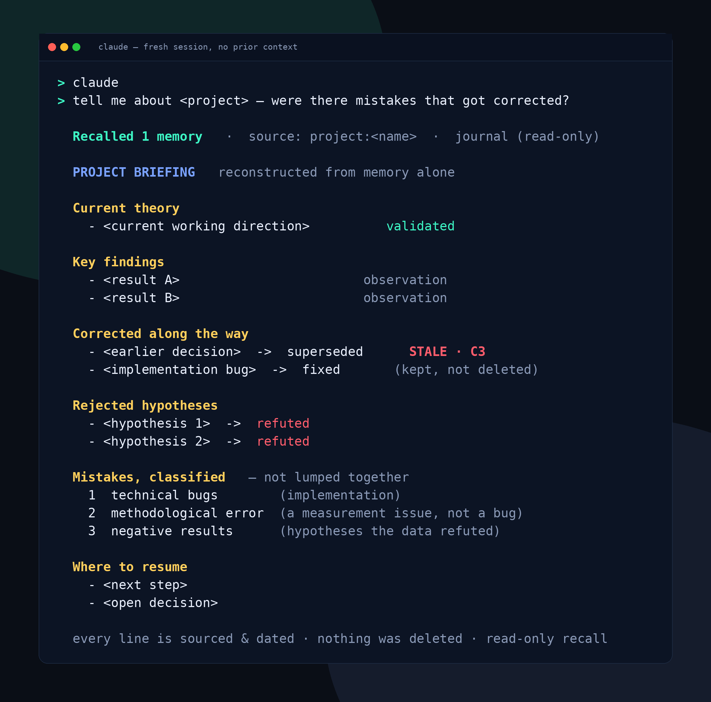

# MultiService IA

> **LLMs forget. Your memory shouldn't.**
>
> *A sovereign memory substrate for LLMs — a force, not a dependency.*

<p align="center">
  
</p>

**Same question. Same history. Two different answers.**  
The difference? One knows a decision has been corrected.

Without memory, the agent re-recommends a **dropped** motor. With MultiService IA, it sees the
decision was **corrected (C3)**, serves the **current truth**, and shows its **provenance** and
**freshness** — memory isn't enough; the edge is **memory + provenance + freshness**.

MultiService IA observes every turn of an LLM conversation (prompt / completion / tool calls /
token usage), remembers it as a dated, sourced, bi-temporal event, and then **restores** it
(recall), **explains** it (why / replay), **economizes** it (caching / context windowing) and
**anticipates** it (pre-heating) — all **locally**, under a strict read-only contract.

It turns a stateless chat into a memory you own: queryable, auditable, and honest about its own
freshness — without ever shipping your data anywhere.

---

## What problem does it solve?

**Without memory:**

- agents repeat abandoned decisions
- context is re-sent every turn
- past reasoning disappears

**With MultiService IA:**

- stale facts are detected
- corrections become first-class events
- every answer can explain where it came from

---

## Why

Conversations with an LLM are ephemeral by default: context is re-sent every turn, knowledge is
lost between sessions, and you can't ask *why* the model said something three days ago.
MultiService IA fixes this with a single, simple idea borrowed from event sourcing: **append every
turn to a local, append-only journal, and never delete anything.** From that journal, everything
else (search, explanation, economy, forecasting) is a pure read.

> Traditional memory answers **"what do I know?"** MultiService IA can also answer **"what is still
> true?"**, **"what was corrected?"**, **"why?"** and **"has this decision been validated?"** —
> through `reasoning()`, `lessons()` and `replay_event()`.

---

## In 30 seconds

```text
Without memory          →  still recommends the NEMA-17 (first idea that comes up)
With MultiService IA    →  detects the NEMA-17 was corrected
                        →  recommends the MG996R + 2:1 gearbox
                        →  explains why (the arm was stalling)
                        →  shows provenance and freshness
```

Most agent memories show diagrams. This one shows a **concrete consequence**: never serving a
decision that has become wrong — without ever losing the history.

---

## Principles (non-negotiable)

These are enforced in code and guarded by tests:

- **Provenance is mandatory.** Every event carries a non-empty `source`. No fact without an origin.
- **Bi-temporality, never deletion.** Events have a `valid_from`; a correction *closes* a fact
  (`valid_to`) but never erases it. Yesterday's truth stays queryable "as it was then."
- **The memory observes; it does not judge or act.** Capture is faithful and total. Filtering
  happens later, at *promotion* and *serving*, gated by a human.
- **Read paths are read-only.** Recall, replay, forecasting and briefing never write the journal,
  never mutate state. A structural test enforces it.
- **Sovereignty.** Inference and embeddings are **100% local** (via [Ollama](https://ollama.com)).
  No hosted inference or embedding API is required or used.

The healthy separation the project preserves:

> **Capture stores · Recall restores · Replay explains · Preheat anticipates · the Human decides.**

---

## How it works

```
 chat turn ──▶ router ──▶ AetherEvent(s) ──▶ append-only journal (.jsonl)
                                                   │
                          ┌────────────────────────┼─────────────────────────┐
                          ▼                         ▼                          ▼
                   recall / brief            replay / replay_event       forecast / economy
                   (find, read-only)         (explain, read-only)        (anticipate, read-only)
                                                   │
                                          local embeddings (bge-m3)
                                          for hybrid semantic recall
```

Every turn becomes one `prompt`, one `completion` and one `token_usage` event, all sharing a
`turn_id` and a `session_id`. The journal is the single source of truth; the rest of the system is
a set of **pure functions** (`List[AetherEvent] → result`). The only component with side effects
is the inference/embedding backend, deliberately isolated.

---

## Concrete demo — DunkBot 3000 🥞🤖


A **100% fictional** demo (no real data) shows the value in one shot: **the same question, without
memory then with.** We're building a pancake-flipping robot; on day 1 we decide on a **NEMA-17**
motor, on day 3 the field corrects it (*"it stalls → use an MG996R servo"*).

```bash
python examples/memory_demo/compare.py
```

```text
WITHOUT MultiService IA  (agent with no memory)
  -> Answers blind. At worst, re-recommends the NEMA-17, unaware it was dropped.

WITH MultiService IA  (local memory, read-only)
  brief() — one single call:
    DECISION  [STALE C3 !] : DunkBot ... NEMA-17 ...
    -> revised since (corrected_by): the decision above is NO LONGER the truth.
  CURRENT TRUTH (correction): ... switch to an MG996R servo + 2:1 gearbox.
  Code found (has_code) / Bill of materials (has_table) ... sourced and dated.
```

**The moral:** without memory, the agent may re-recommend the **stale** motor; with memory plus the
bi-temporal **C3** flag, it serves the current truth, sourced and dated.

There's also a fun, self-contained **GUI** (no server): open **`examples/memory_demo/arcade.html`**
in a browser — type a question, see both panels side by side, the stale fact **struck through** (C3),
and the append-only timeline. Details: [`examples/memory_demo/`](examples/memory_demo/README.md).

---

## Dogfooding: the memory remembers its own development

MultiService IA is used to track MultiService IA itself. When the project license changed from
**MIT** to **Apache-2.0**, the old decision was **closed, never deleted**, and `lessons()` surfaced
the current truth.

<p align="center">
  
</p>

Thirty days later, `recall("license")` returns the **current** truth (Apache-2.0) and flags **MIT as
`STALE (C3)`**, while `lessons()` still explains the **why**. Every frame in that clip is a real
event from the journal — not a fictional demo. *(Full 34s video: [`docs/license-demo.mp4`](docs/license-demo.mp4).)*

---

## From Memory to Knowledge

MultiService IA is not just a chat history. Over weeks and months, the journal accumulates
**decisions, corrections, hypotheses, observations and validations** — all typed, sourced and dated.
That lets a **fresh agent session, with no prior context, reconstruct the state of a project from
memory alone.**

<p align="center">
  
</p>

The agent is no longer recalling isolated facts — it is reconstructing the **intellectual history**
of a project: what was believed, what was wrong, what was corrected, what was validated, and *why*.
A search engine returns documents; this returns a **briefing**. That is why events are **typed,
sourced, dated and never deleted**: knowledge emerges from the journal, and the journal stays the
single source of truth.

---

## The memory surface

The substrate exposes a **read-only** surface (e.g. over [MCP](https://modelcontextprotocol.io) to
an MCP-capable client). All results carry provenance and a freshness flag.

| Tool | Purpose |
|---|---|
| `recall(query, …)` | Relevant memories. Filters: type, source, and **structure** (`has_code`, `has_table`). Each hit carries `superseded` / `corrected_by` (was it revised later?). |
| `recall_semantic(query, …)` | Hybrid recall: lexical coverage **+** local semantic embedding, fused and floored to suppress noise. `explain` mode exposes the sub-scores. |
| `why(turn_id)` | The events of a single turn — "why the agent saw/said this." |
| `replay(session_id, digest=True)` | Replays a session: a compact one-line-per-turn digest by default, or the full dump. |
| `replay_event(event_id, depth)` | The **causal chain** of an event: focus turn + preceding turns + C3 closure/corrections. |
| `forecast(session_id)` | **Pre-heating**: projects the next turn's cost (snowball vs windowed), read-only estimate. |
| `brief(query, k)` | A composed topic brief in one call: memories + bearing decisions + revised items + sessions. |
| `recent(days)` | **"What's new"**: recent decisions, corrections and latest events — the entry point when resuming work. |
| `reasoning(session_id)` | **Reasoning chain** of a session: hypothesis → observation → decision → correction → validation, ordered, with **present/missing stages** (e.g. a decision with no validation). |
| `lessons()` | **Lessons learned** from C3 corrections: what was revised/abandoned + the truths that still stand. Empty until a correction is logged. |
| `index_status()` | Freshness of the semantic index (`eligible` / `indexed` / `fresh`). Tells you when semantic recall is partial. |
| `usage()` | **Reuse instrumentation**: how many turns were served from memory (cache, no model call) and input tokens saved. Measures, doesn't predict. |
| resource `briefing/today` | Daily usage briefing (tokens, compaction savings, by model). |

Two human-gated write paths live in the chat loop (not in the read-only surface):

- `/correct <note>` — records a `correction`, marking prior memories of the session as revised (C3).
- `/note <text>` — records an agent-proposed note (`source=agent:claude`), **validated by the human
  who runs the command** (C1). This lets the memory *compound* from the agent's own reasoning,
  while the query surface stays strictly read-only.

---

## Token economy

Real measurements on live conversations showed that up to **98.5% of input tokens** were context
re-sends (the "snowball" of growing context) rather than new information. MultiService IA attacks
this waste with three read-only-friendly levers:

- **Exact result cache** — identical requests are served without calling the model (C3-guarded:
  a later correction invalidates the entry).
- **Semantic cache** — near-paraphrases of an already-answered prompt are served without the model.
  Decisional, so a deliberately high similarity threshold ("when in doubt, don't serve").
- **Context windowing** — keeps the last *N* turns in clear, bounding the snowball.

Crucially, the savings aren't *claimed* — they're **measured**, read-only, by the `usage()` tool:
how many turns were served from memory, and how many input tokens were actually saved.

> **Live measurement** (one real journal): 199 turns · 595 input tokens saved by windowing ·
> 16 saved by the semantic cache (only recently enabled). *Your numbers depend on usage patterns —
> the point is that they are measured, not asserted.*

---

## Sovereignty & privacy

- Everything runs **on your machine**. The journal lives in a local append-only file.
- Inference and embeddings go through a **local Ollama** instance — no hosted API.
- A routing policy keeps **sensitive content local by construction**: anything flagged as a
  secret/credential or an unauthorized-access intent never leaves the machine — and is never served
  from cache. (When in doubt: local.)
- **This repository ships no data.** Your journal is yours and stays on your disk.

---

## Quick start

Requirements: Python 3.11+, [Ollama](https://ollama.com) running locally.

```bash
# 1. install
pip install -r requirements.txt

# 2. pull a local chat model and an embedding model
ollama pull <your-chat-model>      # any local model; set via OLLAMA_MODEL
ollama pull bge-m3                  # local embeddings for hybrid recall

# 3. chat (capture is automatic; exact + semantic cache and windowing are ON by default)
python -m multiservice.chat --ollama --recall     # add --recall for live memory injection

# 4. (re)build the semantic index after chatting
python -m multiservice.index

# 5. run the tests
pytest -q
```

Configuration lives in `multiservice/config.py` and is overridable via environment variables
(`OLLAMA_MODEL`, `EMBED_MODEL`, `JOURNAL_PATH`, `KEEP_TURNS`, …).

---

## Using it from an MCP client

Run the read-only memory server:

```bash
python -m multiservice.mcp_server
```

Then point an MCP-capable client at it. A minimal client config looks like:

```json
{
  "mcpServers": {
    "multiservice-memory": {
      "command": "/absolute/path/to/python",
      "args": ["-m", "multiservice.mcp_server"],
      "env": { "PYTHONPATH": "/absolute/path/to/this/repo" }
    }
  }
}
```

> The server caches modules at import; restart the client after adding tools.

### Remote access (hosted HTTP server)

The same read-only surface can be served over **HTTPS** for clients on other networks — one central
journal, no copy on the clients. Run the streamable-HTTP entrypoint (behind a reverse proxy that
terminates TLS and authenticates):

```bash
multiservice-mcp-http   # read-only tools over streamable-HTTP (default 0.0.0.0:8302)
```

DNS-rebinding protection stays **on**: declare the public Host(s) you serve via
`MULTISERVICE_HTTP_ALLOWED_HOSTS` (comma-separated, e.g. `mem.example.com`). Put it behind a reverse
proxy adding TLS + a bearer token + an IP allowlist, then connect any machine:

```bash
claude mcp add --transport http multiservice-memory https://mem.example.com/mcp \
  --header "Authorization: Bearer <token>"
```

A ready-to-use recipe (Docker with the journal mounted **read-only** + nginx) is in [`deploy/`](deploy/).

---

## CLI

```bash
python -m multiservice.chat        # chat loop (captures + journals every turn)
python -m multiservice.inspect     # usage observability (read-only)
python -m multiservice.economy     # token accounting: prefix re-send, windowing savings
python -m multiservice.index       # incremental local embedding (re)index
python -m multiservice.preheat     # pre-heating: projected cost of the next turn
python -m multiservice.mcp_server  # read-only MCP memory server
python -m multiservice.projlog "<decision>" --kind decision --session <topic>   # log a project decision
```

In the chat loop: `/correct <note>`, `/note <text>`, `/reset`, `/quit`.

> **Shared memory across projects.** Run `pip install -e .` to make the `projlog` command available
> everywhere on the machine; any project can then feed the same local journal with a namespaced
> source (`projlog "…" --source project:<name> --session <topic>`), isolable via
> `recall(source="project:<name>")`. The query surface stays read-only — only capture writes. See
> [`docs/CAPTURE-CONVENTION.md`](docs/CAPTURE-CONVENTION.md).

> **Dogfooding.** `projlog` writes the project's own decisions/corrections into the journal, so
> `recall`/`brief`/`recent` can ground future work in past reasoning — the memory remembers its own
> development. It's a capture (append-only); the MCP query surface stays read-only.

---

## Project status

Working engine with a full read-only memory surface, exact + semantic caching, context windowing,
emergent-skill scaffolding, append-only backup with SHA-256 manifests, and local hybrid recall.
**Covered by a growing pytest suite (currently green).** Each feature ships with a permanent
regression test; every issue surfaced by real usage becomes a test.

---

## Roadmap

- **Multi-provider routing** — optional cloud backends behind the same interface, governed by the
  "sensitive → local only" policy; exploit cloud prompt-caching where the local model can't.
- ✅ **A second (hosted) read-only surface** — shipped: streamable-HTTP server, see [`deploy/`](deploy/).
- **Authenticated remote write (ingest)** — let remote machines feed the central journal (separate
  write token), instead of only reading it.

---

## Design lineage

The constitutional principles (mandatory provenance, bi-temporal closure-never-deletion,
human-in-the-loop) are inherited from a companion bi-temporal event-sourcing system and applied
here to LLM exchanges. The result is a memory that is faithful by capture and trustworthy by
construction.

---

## License

**Apache License 2.0** — see [`LICENSE`](LICENSE) and [`NOTICE`](NOTICE). Permissive (free for
commercial use), with an explicit patent grant. © 2026 MultiService IA authors.

---

## A note on your data

MultiService IA is designed so that your conversation history never leaves your control. The code
in this repository describes the *system*, not your memory: no journal content is bundled, and none
should be committed. Keep your `*.jsonl` journals out of version control (add them to
`.gitignore`).
